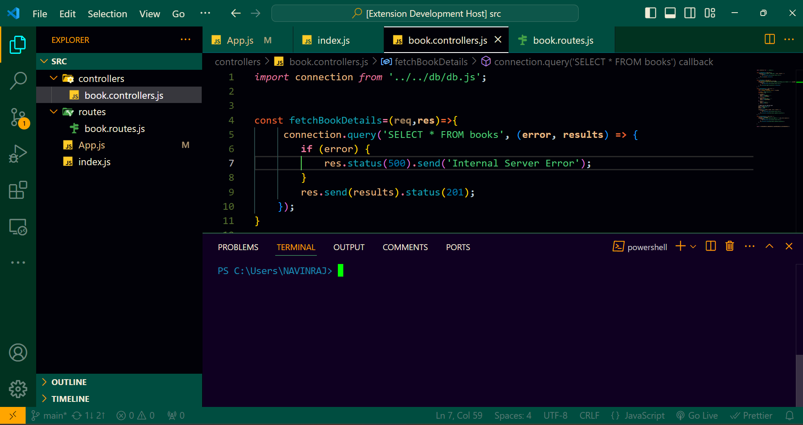

# Dark Emerald - VS Code Theme

**Capture the Essence of a Dark Theme with Green**

Dark Emerald is a captivating dark mode theme for Visual Studio Code, designed to provide a visually appealing and comfortable coding experience. This theme features a soothing emerald green as the primary color, complemented by a carefully selected palette for an immersive coding environment.

**Features:**

* **Elegant Dark Background:** Deep midnight green reduces eye strain and enhances focus.
* **Emerald Green Syntax Highlighting:** Keywords stand out in vibrant emerald green.
* **Contrasting Colors:** Eggshell, orange peel, cerulean, and turquoise blue differentiate code elements.
* **UI Customization:** Cohesive color scheme with dark forest green activity bar, teal green status bar, and dark olive green sidebar.
* **Readable Comments:** Light gray (#dcdcdc) ensures comments are clear without distraction.
* **Highlighting and Selection:** #ff00885d selection background and medium sea green line highlights for easy navigation.

**Installation:**

1. Open the Extensions sidebar (View → Extensions)
2. Search for "Dark Emerald"
3. Click Install and Reload VS Code

**Usage:**

1. Open the Command Palette (Ctrl+Shift+P or Cmd+Shift+P)
2. Select Preferences: Color Theme
3. Choose "Dark Emerald"

**Screenshots:**

Dark Emerald Screenshot 1
 

Dark Emerald Screenshot 2
 

**Feedback:**

We value your feedback! Leave a review or report issues on our GitHub repository: [Dark-Emerald-vscode-theme](https://github.com/navinAce/dark-emerald-vscode-theme)